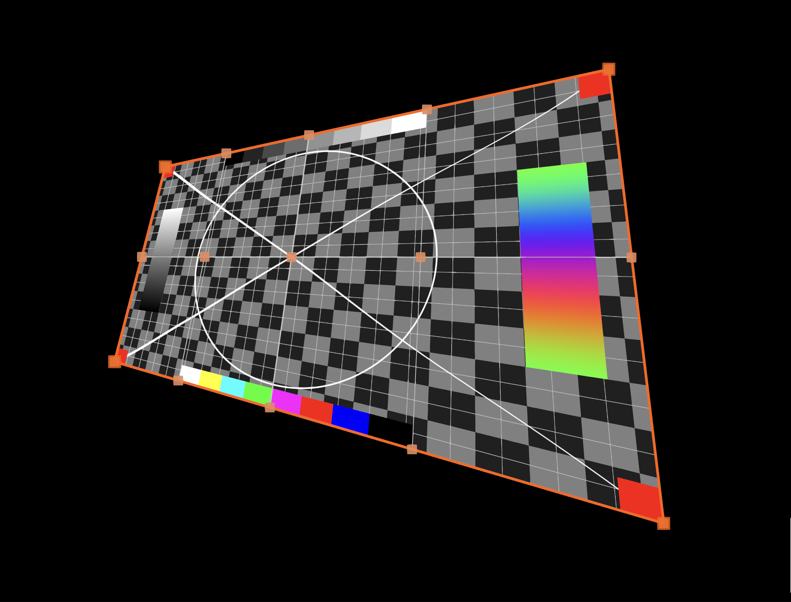

# three-projection-mapper

<p align="center">
  
</p>

<p align="center">
  
  
</p>

> **In active development.** API and architecture are subject to breaking changes. Not recommended for production use yet.

---

A projection mapping library for [Three.js](https://threejs.org/). Warp and align any Three.js scene onto physical surfaces — without leaving the browser.

**[Live Examples](https://bhoffmann93.github.io/three-projection-mapper/)**

---

## How it works

You render your Three.js scene into a texture, pass it to `ProjectionMapper`, and it gives you interactive control points to warp, stretch, and align the output to match your projection surface. All calibration data is saved automatically so your setup persists across sessions.

```
Your Three.js Scene → RenderTarget → ProjectionMapper → Projector
                                           ↕
                                    Drag control points
                                    to align on surface
```

---

## Features

- **Corner control points** — 4 outer points for broad perspective correction
- **Grid control points** — configurable inner grid for fine-grained surface warping (Bilinear or Bicubic Warping)
- **Testcard overlay** — procedural pattern (resolution-independent)
- **GUI** — Tweakpane based UI included
- **Auto-save** — warp positions saved to `localStorage`, restored on reload
- **Multi-window mode** — separate controller and projector windows, synced in real time (no server needed)
- **Hardware optics support** — camera class for physical throw ratio and lens shift correction

## Installation

```bash
npm install github:bhoffmann93/three-projection-mapper
```

---

## Quick Start

The core idea: Render your scene to a WebGLRenderTarget, then hand its texture to ProjectionMapper.

Resolution & Quality: While you should at least match your projector's native resolution, it is highly recommended to oversample the RenderTarget (e.g., 1.5x or 2x). This prevents aliasing artifacts and maintains sharpness when the texture is stretched or compressed during the warping process.

In your animation loop, simply call mapper.render() as the final step.

```typescript
import * as THREE from 'three';
import { ProjectionMapper, ProjectionMapperGUI, GUI_ANCHOR } from 'three-projection-mapping';

const renderer = new THREE.WebGLRenderer();
renderer.setSize(window.innerWidth, window.innerHeight);
document.body.appendChild(renderer.domElement);

const projectorRes = { width: 1280, height: 800 };
const aspect = projectorRes.width / projectorRes.height;

const scene = new THREE.Scene();
const camera = new THREE.PerspectiveCamera(75, aspect, 0.1, 1000);
scene.add(new THREE.Mesh(new THREE.BoxGeometry(), new THREE.MeshNormalMaterial()));

// Render your scene off-screen into target
const oversampling = 1.5;
const renderTarget = new THREE.WebGLRenderTarget(
  projectorRes.width * oversampling, 
  projectorRes.height * oversampling
);

const mapper = new ProjectionMapper(renderer, renderTarget.texture);
const gui = new ProjectionMapperGUI(mapper, { title: 'Projection Mapper', anchor: GUI_ANCHOR.LEFT });

function animate() {
  requestAnimationFrame(animate);

  // 1. Render your scene into the render target
  renderer.setRenderTarget(renderTarget);
  renderer.render(scene, camera);

  // 2. Render the warped output to screen
  renderer.setRenderTarget(null);
  mapper.render();
}

animate();

window.addEventListener('keydown', (e) => {
  if (e.key === 'g' || e.key === 'p') gui.toggle();
  if (e.key === 't') gui.toggleTestCard();
  if (e.key === 'h') gui.toggleWarpUI();
});
```

## Multi-Window Setup

For real installations, you'll typically want two separate browser windows:

- **Controller window** — your laptop: GUI, drag controls, preview
- **Projector window** — your projector display: output only, no controls

State syncs automatically between them via the browser's `BroadcastChannel` API — no server or network needed.

```
┌─────────────────────────┐                    ┌─────────────────────────┐
│   Controller Window     │◄── local sync ────►│   Projector Window      │
├─────────────────────────┤                    ├─────────────────────────┤
│ • Tweakpane GUI         │  warp points,      │ • No GUI                │
│ • Drag controls         │  settings, etc.    │ • Drag disabled         │
│ • Testcard toggle       │                    │ • Fullscreen output     │
└─────────────────────────┘                    └─────────────────────────┘
```

**Step 1 — Shared scene class** (used in both windows):

```typescript
// ProjectionScene.ts
import * as THREE from 'three';

export class ProjectionScene {
  public readonly scene: THREE.Scene;
  public readonly camera: THREE.PerspectiveCamera;
  public readonly renderTarget: THREE.WebGLRenderTarget;
  private cube: THREE.Mesh;

  constructor(config: { width: number; height: number }) {
    this.scene = new THREE.Scene();
    this.camera = new THREE.PerspectiveCamera(75, config.width / config.height, 0.1, 1000);
    this.cube = new THREE.Mesh(new THREE.BoxGeometry(), new THREE.MeshNormalMaterial());
    this.scene.add(this.cube);
    this.renderTarget = new THREE.WebGLRenderTarget(config.width, config.height);
  }

  public animate(): void {
    this.cube.rotation.y += 0.01;
  }

  public render(renderer: THREE.WebGLRenderer): void {
    renderer.setRenderTarget(this.renderTarget);
    renderer.render(this.scene, this.camera);
  }

  public getTexture(): THREE.Texture {
    return this.renderTarget.texture;
  }
}
```

**Step 2 — Controller window:**

```typescript
// controller.ts
import * as THREE from 'three';
import { ProjectionMapper, ProjectionMapperGUI, GUI_ANCHOR } from 'three-projection-mapping';
import { WindowSync, WINDOW_SYNC_MODE } from 'three-projection-mapping/addons';
import { ProjectionScene } from './ProjectionScene';

const renderer = new THREE.WebGLRenderer();
renderer.setSize(window.innerWidth, window.innerHeight);
document.body.appendChild(renderer.domElement);

const projectionScene = new ProjectionScene({ width: 1280, height: 800 }); //Projector Resolution
const mapper = new ProjectionMapper(renderer, projectionScene.getTexture());
const sync = new WindowSync(mapper, { mode: WINDOW_SYNC_MODE.CONTROLLER });

const gui = new ProjectionMapperGUI(mapper, {
  title: 'Controller',
  anchor: GUI_ANCHOR.LEFT,
  eventChannel: sync.getEventChannel(),
  windowManager: sync.getWindowManager(),
});

// Press O to open the projector window
window.addEventListener('keydown', (e) => {
  if (e.key === 'o') sync.openProjectorWindow();
});

function animate() {
  requestAnimationFrame(animate);
  projectionScene.animate();
  projectionScene.render(renderer);
  renderer.setRenderTarget(null);
  mapper.render();
}
animate();

window.addEventListener('keydown', (e) => {
  if (e.key === 'g' || e.key === 'p') gui.toggle();
  if (e.key === 't') gui.toggleTestCard();
  if (e.key === 'h') gui.toggleWarpUI();
});
```

**Step 3 — Projector window:**

```typescript
// projector.ts
import * as THREE from 'three';
import { ProjectionMapper } from 'three-projection-mapping';
import { WindowSync, WINDOW_SYNC_MODE } from 'three-projection-mapping/addons';
import { ProjectionScene } from './ProjectionScene';

const renderer = new THREE.WebGLRenderer();
renderer.setSize(1280, 800);
document.body.appendChild(renderer.domElement);

const projectionScene = new ProjectionScene({ width: 1280, height: 800 });
const mapper = new ProjectionMapper(renderer, projectionScene.getTexture());
const sync = new WindowSync(mapper, { mode: WINDOW_SYNC_MODE.PROJECTOR });
// WindowSync automatically hides controls and disables drag in projector mode

function animate() {
  requestAnimationFrame(animate);
  projectionScene.animate();
  projectionScene.render(renderer);
  renderer.setRenderTarget(null);
  mapper.render();
}
animate();
```

See the full working example in `/examples/multi-window/`.

---

## API Reference

### `ProjectionMapper`

```typescript
new ProjectionMapper(
  renderer: THREE.WebGLRenderer,
  inputTexture: THREE.Texture,
  config?: ProjectionMapperConfig
)
```

**Config options:**

```typescript
interface ProjectionMapperConfig {
  resolution?: { width: number; height: number }; // Default: input texture size
  segments?: number; // Mesh density (default: 50)
  gridControlPoints?: { x: number; y: number }; // Grid size (auto-calculated if omitted)
  antialias?: boolean; // Enable SMAA (default: true)
  planeScale?: number; // Fill factor 0–1 (default: 0.5)
}
```

**Methods:**

| Method                            | Description                      |
| --------------------------------- | -------------------------------- |
| `render()`                        | Render the warped output         |
| `setTexture(texture)`             | Swap the input texture           |
| `setShowTestCard(show)`           | Toggle testcard                  |
| `setShowControlLines(show)`       | Show/hide control line overlay   |
| `resize(width, height)`           | Handle window resize             |
| `setControlsVisible(visible)`     | Show/hide all control points     |
| `setGridPointsVisible(visible)`   | Show/hide grid points            |
| `setCornerPointsVisible(visible)` | Show/hide corner points          |
| `setOutlineVisible(visible)`      | Show/hide outline                |
| `setGridSize(x, y)`               | Change grid density (2–10)       |
| `setPlaneScale(scale)`            | Set fill factor (0–1)            |
| `setShouldWarp(enabled)`          | Enable/disable warping           |
| `setCameraOffset(x, y)`           | Offset the orthographic camera   |
| `getCameraOffset()`               | Get current camera offset        |
| `reset()`                         | Reset warp and clear saved state |
| `getWarper()`                     | Access the internal `MeshWarper` |
| `dispose()`                       | Clean up GPU resources           |

---

### `ProjectionMapperGUI`

Optional calibration interface built on Tweakpane.

```typescript
import { ProjectionMapperGUI, GUI_ANCHOR } from 'three-projection-mapping';

const gui = new ProjectionMapperGUI(mapper, {
  title: 'My Projection',
  anchor: GUI_ANCHOR.LEFT, // or GUI_ANCHOR.RIGHT
});

gui.toggle();
gui.show();
gui.hide();
gui.dispose();

//add those shortcuts to your project
window.addEventListener('keydown', (e) => {
  if (e.key === 'g' || e.key === 'p') gui.toggle();
  if (e.key === 't') gui.toggleTestCard();
  if (e.key === 'h') gui.toggleWarpUI();
});
```

---

### `ProjectorCamera`

A camera class that mirrors real projector optics — useful when your 3D scene should match what a physical projector would render.

```typescript
import { ProjectorCamera } from 'three-projection-mapping';

const camera = new ProjectorCamera(
  1.65, // throwRatio: distance-to-width ratio (check your projector's spec sheet)
  1.0, // lensShiftY: vertical lens shift (1.0 = 100%)
  16 / 10, // aspect ratio
);
camera.position.set(0, 0.5, 2.0); // The Y position is the lens center
```

**Parameters:**

| Parameter     | Description                                        |
| ------------- | -------------------------------------------------- |
| `throwRatio`  | Distance-to-width ratio (typical range: 0.8 – 2.5) |
| `lensShiftY`  | Vertical lens shift as multiplier (1.0 = 100%)     |
| `aspect`      | Width / height                                     |
| `near`, `far` | Clipping planes (default: 0.1, 1000)               |

---

### `WindowSync`

Multi-window synchronization addon.

```typescript
import { WindowSync, WINDOW_SYNC_MODE } from 'three-projection-mapping/addons';

// Controller
const sync = new WindowSync(mapper, { mode: WINDOW_SYNC_MODE.CONTROLLER });
sync.openProjectorWindow();
sync.onProjectorReady(() => console.log('Projector connected'));

// Projector
const sync = new WindowSync(mapper, { mode: WINDOW_SYNC_MODE.PROJECTOR });
```

| Method                       | Description                     |
| ---------------------------- | ------------------------------- |
| `openProjectorWindow()`      | Open the projector window       |
| `closeProjectorWindow()`     | Close the projector window      |
| `onProjectorReady(callback)` | Called when projector connects  |
| `getEventChannel()`          | IPC event channel (pass to GUI) |
| `getWindowManager()`         | Window manager (pass to GUI)    |
| `destroy()`                  | Clean up                        |

---

### `MeshWarper` (advanced)

Direct access to the warp mesh for custom setups.

```typescript
const warper = mapper.getWarper();

warper.setDragEnabled(false);
warper.setWarpMode(WARP_MODE.bicubic);
warper.setShouldWarp(true);
```

---

## Development

```bash
npm start          # Dev server at http://localhost:8080
npm run build      # Production build
npm run build:lib  # Build library for distribution
npm test           # Run tests with Vitest
```

---

## Roadmap

- [ ] Image Adjustments (Brightness, Contrast, Gamma)
- [ ] Option to draw SDF-Based Beziert Mask in Fragment Shader
- [ ] Save and Load Warp Settings (JSON Export Import)
- [ ] Tutorial: Optical Alignment of Virtual Threejs Camera with the Physical Projector
- [ ] Test React Three Fiber Compatibility

- [ ] Optional: Option to add multiple Meshes like [p5 Mapper](https://github.com/jdeboi/p5.mapper)
- [ ] Optional: [Edge Blending](https://paulbourke.net/miscellaneous/edgeblend/) for Multiple Projector Setups

## License

AGPL-3.0-or-later

The bicubic warp algorithm is adapted to GLSL from the C++ implementation of [Omnidome](https://github.com/WilstonOreo/omnidome) by Michael Winkelmann, licensed under AGPL.

Perspective transform (homography solver) adapted from [perspective-transform](https://github.com/jlouthan/perspective-transform).

## Note

The following parts have been developed with AI-Assistance (Claude):

- GUI Local Storage Saving
- Multi Window System
- Readme
