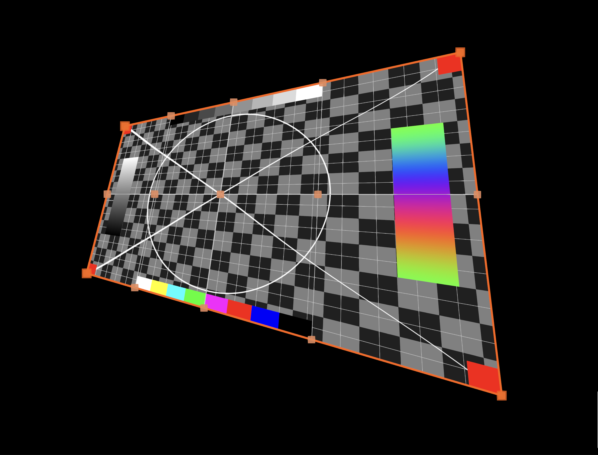

# three-projection-mapper

<p align="center">
  
</p>

<p align="center">
  
  
</p>

> **In active development.** API and architecture are subject to breaking changes. Not recommended for production use yet.

---

A projection mapping library for [Three.js](https://threejs.org/).

**[Live Examples](https://bhoffmann93.github.io/three-projection-mapper/)**

The main use case is to match your Three.js camera to the physical projector's real-world position and optics using ProjectorCamera, so the virtual scene aligns with the physical surface — which can then be fine-tuned with warping. It accepts any THREE.WebGLRenderTarget or THREE.Texture, so it works with 3D scenes, canvas textures, videos, or any other source. See the examples for 2D content usage.

---

## How it works

Pass any `THREE.Texture` to `ProjectionMapper` and it gives you interactive control points to warp and align the output to match your projection surface. All calibration data is saved automatically so your setup persists across sessions.

```
Texture source → ProjectionMapper → Projector
                       ↕
              Drag control points
              to align on surface
```

The texture source can be a **3D scene** rendered into a `WebGLRenderTarget`, a plain **HTML canvas** or **p5.js sketch** wrapped with `THREE.CanvasTexture`, a static image, or anything else that produces a `THREE.Texture`.

---

## Features

- **Corner control points** — 4 outer points for broad perspective correction
- **Grid control points** — configurable inner grid for fine-grained surface warping (Bilinear or Bicubic Warping)
- **Multiple surfaces** — several independently warped surfaces in one output; click a surface on the canvas to select it, drag its body to move it
- **Per-surface everything** — each surface owns its warp, resolution, source texture, crop, image adjustments and masks
- **Polygon mask** — interactive closed polygon evaluated as an SDF in the fragment shader; click edges to insert nodes, double-click to remove, with feather and invert support
- **Image adjustments** — contrast, hue, gamma, saturation, blacks/whites, ACES tonemapping (per surface, for matching projectors)
- **Edge feather** — per-surface feather mask for blending overlapping projections
- **Testcard overlay** — procedural pattern (resolution- and aspect-independent)
- **GUI** — Tweakpane based UI included
- **Auto-save** — all settings saved to `localStorage`, restored on reload
- **Multi-window mode** — separate controller and projector windows, synced in real time (no server needed)
- **Hardware optics support** — camera class for physical throw ratio and lens shift correction

## Installation

```bash
npm install github:bhoffmann93/three-projection-mapper
```

---

## Quick Start

The core idea: Render your scene to a WebGLRenderTarget, then hand its texture to ProjectionMapper.

Resolution & Quality: While you should at least match your projector's native resolution, it is highly recommended to oversample the RenderTarget (e.g., 1.5x or 2x). This prevents aliasing artifacts and maintains sharpness when the texture is stretched or compressed during the warping process.

In your animation loop, simply call mapper.render() as the final step.

```typescript
import * as THREE from 'three';
import { ProjectionMapper, ProjectionMapperGUI } from 'three-projection-mapping';

const renderer = new THREE.WebGLRenderer();
renderer.setSize(window.innerWidth, window.innerHeight);
document.body.appendChild(renderer.domElement);

const projectorRes = { width: 1280, height: 800 };
const aspect = projectorRes.width / projectorRes.height;

const scene = new THREE.Scene();
const camera = new THREE.PerspectiveCamera(75, aspect, 0.1, 1000);
scene.add(new THREE.Mesh(new THREE.BoxGeometry(), new THREE.MeshNormalMaterial()));

// Render your scene off-screen into target
const oversampling = 1.5;
const renderTarget = new THREE.WebGLRenderTarget(projectorRes.width * oversampling, projectorRes.height * oversampling);

const mapper = new ProjectionMapper(renderer, renderTarget.texture);
const gui = new ProjectionMapperGUI(mapper, { title: 'Projection Mapper', anchor: 'left' });

function animate() {
  requestAnimationFrame(animate);

  // 1. Render your scene into the render target
  renderer.setRenderTarget(renderTarget);
  renderer.render(scene, camera);

  // 2. Render the warped output to screen
  renderer.setRenderTarget(null);
  mapper.render();
}

animate();

// Hotkeys are not built into the library — wire them yourself:
const hint = document.createElement('div');
hint.style.cssText =
  'position:fixed;bottom:16px;left:16px;color:rgba(255,255,255,0.5);font:12px/1.6 monospace;pointer-events:none';
hint.innerHTML = '<span>G</span> toggle UI<br><span>T</span> test card<br><span>W</span> warp controls';
document.body.appendChild(hint);

window.addEventListener('keydown', (e) => {
  if (e.key === 'g' || e.key === 'p') gui.toggle();
  if (e.key === 't') gui.toggleTestCard();
  if (e.key === 'w') gui.toggleWarpUI();
});
```

> **Canvas / p5.js:** If you're drawing with p5.js or a plain 2D canvas instead of a 3D scene, skip the render target — wrap the canvas element directly with `new THREE.CanvasTexture(canvasEl)` and set `canvasTexture.needsUpdate = true` each frame. See [`/examples/p5-canvas`](./examples/p5-canvas/) for a working example.

## Multiple Surfaces

A mapper can hold several independently warped surfaces. Each one owns its warp,
resolution, source texture, crop, image adjustments and masks.

Click a surface on the canvas to select it; drag its body to move it. Only the
active surface shows drag handles, the others stay as dimmed outlines.

```typescript
const mapper = new ProjectionMapper(renderer, texture, {
  appId: 'my-app',
  resolution: { width: 1920, height: 1080 }, // the output canvas
  surfaceResolution: { width: 1080, height: 1080 }, // default surface shape
});

// A surface that overrides the default shape
mapper.addSurface({ resolution: { width: 1080, height: 1920 } });

// Change the canvas later — surfaces keep their own shapes and warps
mapper.setOutputResolution(1080, 1920);
```

The controller draws the canvas as a dashed boundary so you can see what is
actually projected. It previews at `zoom < 1`, deliberately showing more than the
output; anything outside the dashed frame is not projected.

### The three resolutions

These are separate on purpose, and mixing them up is the main way multi-surface
layouts go wrong:

```
ProjectionMapper
  resolution         → the output canvas: the dashed frame on the controller,
                       and the size the projector window opens at
  surfaceResolution  → the shape given to surfaces that do not declare their own
  (buffer)           → the source texture, entirely the app's business
```

| | is | multi-surface example |
| --- | --- | --- |
| **`resolution`** | the output canvas — what the projector frames | 1920×1080 |
| **`surfaceResolution`** | default shape of a surface | 1080×1080 |
| **buffer** | pixel size of the source texture, set by your render target | 2160×1080 |
| **`uvRect`** | which slice of the buffer a surface samples | `0.5, 0 → 0.5, 1` |

The library never creates the buffer — you do, at whatever size your pipeline
needs, and it is unrelated to either resolution above.

**`resolution` is really an aspect declaration.** Only the ratio is used: a plane
is `WORLD_PLANE_HEIGHT` tall with an aspect-correct width, so `1920×1080` and
`3840×2160` behave identically. The absolute numbers matter in exactly one place,
the size the projector window first opens at. Resizing that window scales the
output; giving it a different aspect letterboxes rather than distorting, because
the camera contains the canvas on whichever axis is tighter.

**A surface shows undistorted content** when its resolution matches the region it
samples:

```
uvRect.scaleX / uvRect.scaleY  =  surfaceAspect / bufferAspect
```

Set `resolution` alone and surfaces inherit it, which is right when a surface
fills the output. Set `surfaceResolution` too when they should not — an atlas
layout wants the region's shape, not the canvas's.

### Moving and resizing surfaces

Dragging the corners does placement and perspective in one gesture, which is what
calibration wants. These cover what dragging cannot express — exact sizes, equal
sizes, programmatic layout:

| Method | Warp | Use |
| --- | --- | --- |
| `translate(dx, dy)` / `setPosition(x, y)` | kept | move the quad |
| `scale(factorX, factorY?)` | **kept** | resize about the centroid |
| `setWarpedSize(width, height)` | **kept** | resize to an exact world size |
| `setBounds(x, y, width, height)` | **discarded** | lay out as a rectangle, before calibrating |

`scale` and `setWarpedSize` multiply each corner's offset from the centre, so a
calibrated perspective survives being resized. `setBounds` replaces the quad
outright — reach for it when arranging surfaces inside the output canvas, not
after aligning one to a physical object.

```typescript
// give two surfaces exactly the same size
const { width, height } = surfaceA.getWarpedSize();
surfaceB.setWarpedSize(width, height);

surface.scale(1.05); // 5% larger, perspective intact
```

### Overlapping surfaces

Surfaces are drawn in list order, last on top, and clicking picks whatever is
visible — the picker follows the same order. Overlap matters for edge blending,
so it is set explicitly rather than left to depth sorting between coplanar
surfaces:

```typescript
mapper.moveSurface(id, +1); // towards the front
mapper.moveSurface(id, -1); // towards the back
mapper.getSurfaceIndex(id); // where it currently sits
```

The order persists with the surface list, and the built-in pane exposes it as
Back/Front buttons beside Add/Remove.

### Size-independent content

A surface can be scaled to any shape, which stretches whatever it samples. When
the content is generated — a shader drawing into your buffer — it can compensate
instead, if it knows the shape it will land on:

```typescript
// each frame, before rendering your buffer
material.uniforms.uSurfaceAspect.value = surface.getWarpedAspect();
```

```glsl
// a circle that stays round however the surface is scaled
vec2 p = (uv - 0.5) * vec2(uSurfaceAspect, 1.0);
float circle = step(length(p), 0.4);
```

`getWarpedSize()` returns the same measurement in world units. Both describe the
surface **as drawn** — scaling and warping included — averaged over opposite
edges of the quad, unlike `getResolution()`, which is its undeformed shape.

Read it per frame rather than on a callback: dragging a corner changes the size
continuously, and no notification fires for it.

### Atlas or per-surface media

Each surface owns its own texture uniform, so these are the same model rather
than two modes:

```typescript
// Atlas: one buffer, sliced by uvRect
mapper.setUvRect(0, 0, 0.5, 1, wideSurface.id);
mapper.setUvRect(0.5, 0, 0.5, 1, squareSurface.id);

// Per-surface media: this surface ignores the shared buffer entirely
mapper.setTexture(myImageTexture, squareSurface.id);
```

[`/examples/multi-surface`](./examples/multi-surface/) does both at once: two
surfaces slicing one atlas, and a third sampling its own image and taking that
image's shape. It also ships a projector window, showing that only calibration
crosses the channel — both windows build their own textures.

### Single-surface mode

If your app only ever wants one surface, say so. `addSurface()` is then refused,
extra surfaces left in storage are ignored rather than restored, canvas selection
is not installed, and the GUI drops its surface and crop controls:

```typescript
const mapper = new ProjectionMapper(renderer, texture, {
  appId: 'my-app',
  multiSurface: false,
});
```

---

## Multi-Window Setup

For real installations, you'll typically want two separate browser windows:

- **Controller window** — your laptop: GUI, drag controls, preview
- **Projector window** — your projector display: output only, no controls

State syncs automatically between them via the browser's `BroadcastChannel` API — no server or network needed.

```
┌─────────────────────────┐                    ┌─────────────────────────┐
│   Controller Window     │◄── local sync ────►│   Projector Window      │
├─────────────────────────┤                    ├─────────────────────────┤
│ • Tweakpane GUI         │  warp points,      │ • No GUI                │
│ • Drag controls         │  settings, etc.    │ • Drag disabled         │
│ • Testcard toggle       │                    │ • Fullscreen output     │
│ • previews at zoom < 1, │                    │ • frames the canvas     │
│   canvas drawn dashed   │                    │   exactly, at zoom 1    │
└─────────────────────────┘                    └─────────────────────────┘
```

**Only calibration crosses the channel — never pixels.** A `THREE.Texture` cannot
be sent over a `BroadcastChannel`, so both windows build their own: they run the
same scene class, and an app showing media loads its own copy in each window and
binds it to the agreed surface id.

**Give both windows the same resolutions and the same `appId`.** They share
`localStorage`, so the projector restores calibration on boot; if the two
disagree about the output canvas or the default surface shape, their planes
differ and the projector's output will not match the controller's preview. Put
them in one config module both import:

```typescript
// projection.config.ts — imported by controller and projector
export const PROJECTION_CONFIG = {
  appId: 'my-installation',
  resolution: { width: 1920, height: 1080 }, // output canvas
  surfaceResolution: { width: 1080, height: 1080 }, // default surface shape
} as const;
```

The projector window opens at the output `resolution`'s aspect, scaled to fit the
screen — so a 9:16 output opens a portrait window rather than a landscape one.

See [`/examples/multi-surface`](./examples/multi-surface/) for this with several
surfaces, including one that samples its own image instead of the shared buffer.

**Step 1 — Shared scene class** (used in both windows):

```typescript
// ProjectionScene.ts
import * as THREE from 'three';

export class ProjectionScene {
  public readonly scene: THREE.Scene;
  public readonly camera: THREE.PerspectiveCamera;
  public readonly renderTarget: THREE.WebGLRenderTarget;
  private cube: THREE.Mesh;

  constructor(config: { width: number; height: number }) {
    this.scene = new THREE.Scene();
    this.camera = new THREE.PerspectiveCamera(75, config.width / config.height, 0.1, 1000);
    this.cube = new THREE.Mesh(new THREE.BoxGeometry(), new THREE.MeshNormalMaterial());
    this.scene.add(this.cube);
    this.renderTarget = new THREE.WebGLRenderTarget(config.width, config.height);
  }

  public animate(): void {
    this.cube.rotation.y += 0.01;
  }

  public render(renderer: THREE.WebGLRenderer): void {
    renderer.setRenderTarget(this.renderTarget);
    renderer.render(this.scene, this.camera);
  }

  public getTexture(): THREE.Texture {
    return this.renderTarget.texture;
  }
}
```

**Step 2 — Controller window:**

```typescript
// controller.ts
import * as THREE from 'three';
import { ProjectionMapper, ProjectionMapperGUI } from 'three-projection-mapping';
import { WindowSync, WINDOW_SYNC_MODE } from 'three-projection-mapping/addons';
import { ProjectionScene } from './ProjectionScene';

const renderer = new THREE.WebGLRenderer();
renderer.setSize(window.innerWidth, window.innerHeight);
document.body.appendChild(renderer.domElement);

const projectionScene = new ProjectionScene({ width: 1280, height: 800 }); //Projector Resolution
const mapper = new ProjectionMapper(renderer, projectionScene.getTexture());
const sync = new WindowSync(mapper, { mode: WINDOW_SYNC_MODE.CONTROLLER });

const gui = new ProjectionMapperGUI(mapper, {
  title: 'Controller',
  anchor: 'left',
  eventChannel: sync.getEventChannel(),
  windowManager: sync.getWindowManager(),
});

// Hotkeys are not built into the library — wire them yourself:
const hint = document.createElement('div');
hint.style.cssText =
  'position:fixed;bottom:16px;left:16px;color:rgba(255,255,255,0.5);font:12px/1.6 monospace;pointer-events:none';
hint.innerHTML =
  '<span>G</span> toggle UI<br><span>T</span> test card<br><span>W</span> warp controls<br><span>O</span> open projector';
document.body.appendChild(hint);

window.addEventListener('keydown', (e) => {
  if (e.key === 'g' || e.key === 'p') gui.toggle();
  if (e.key === 't') gui.toggleTestCard();
  if (e.key === 'w') gui.toggleWarpUI();
  if (e.key === 'o') sync.openProjectorWindow();
});

function animate() {
  requestAnimationFrame(animate);
  projectionScene.animate();
  projectionScene.render(renderer);
  renderer.setRenderTarget(null);
  mapper.render();
}
animate();
```

**Step 3 — Projector window:**

```typescript
// projector.ts
import * as THREE from 'three';
import { ProjectionMapper } from 'three-projection-mapping';
import { WindowSync, WINDOW_SYNC_MODE } from 'three-projection-mapping/addons';
import { ProjectionScene } from './ProjectionScene';

const renderer = new THREE.WebGLRenderer();
renderer.setSize(1280, 800);
document.body.appendChild(renderer.domElement);

const projectionScene = new ProjectionScene({ width: 1280, height: 800 });
const mapper = new ProjectionMapper(renderer, projectionScene.getTexture());
const sync = new WindowSync(mapper, { mode: WINDOW_SYNC_MODE.PROJECTOR });
// WindowSync automatically hides controls and disables drag in projector mode

function animate() {
  requestAnimationFrame(animate);
  projectionScene.animate();
  projectionScene.render(renderer);
  renderer.setRenderTarget(null);
  mapper.render();
}
animate();
```

See the full working example in `/examples/multi-window/`.

---

## API Reference

### `ProjectionMapper`

```typescript
new ProjectionMapper(
  renderer: THREE.WebGLRenderer,
  inputTexture: THREE.Texture,
  config?: ProjectionMapperConfig
)
```

**Config options:**

```typescript
interface ProjectionMapperConfig {
  resolution?: { width: number; height: number }; // View aspect + default surface resolution
  segments?: number; // Mesh density (default: 50)
  gridControlPoints?: { x: number; y: number }; // Grid size (auto-calculated if omitted)
  antialias?: boolean; // Enable SMAA (default: true)
  zoom?: number; // Fill factor 0–1 (default: 0.5)
  multiSurface?: boolean; // Allow more than one surface (default: true)
  canvasSelection?: boolean; // Click/drag surfaces on the canvas (default: true)
  appId?: string; // Scopes saved calibration — required if several apps share an origin
}
```

> **`appId` matters more than it looks.** Everything is saved to `localStorage`, which is shared by every app on an origin. Without an `appId` two apps overwrite each other's surfaces and warp points.

**Methods:**

| Method                            | Description                      |
| --------------------------------- | -------------------------------- |
| `render()`                        | Render the warped output         |
| `setTexture(texture, surfaceId?)` | Swap the shared buffer, or one surface's own texture |
| `getTexture(surfaceId?)`          | The shared buffer, or one surface's texture |
| `setShowTestCard(show)`           | Toggle testcard                  |
| `setShowControlLines(show)`       | Show/hide control line overlay   |
| `resize(width, height)`           | Handle window resize             |
| `setControlsVisible(visible)`     | Show/hide all control points     |
| `setGridPointsVisible(visible)`   | Show/hide grid points            |
| `setCornerPointsVisible(visible)` | Show/hide corner points          |
| `setOutlineVisible(visible)`      | Show/hide outline                |
| `setGridSize(x, y)`               | Change grid density (2–10)       |
| `setZoom(scale)`                  | Set fill factor (0–1)            |
| `setShouldWarp(enabled)`          | Bypass warping (no GUI button; for host apps) |
| `setCameraOffset(x, y)`           | Offset the orthographic camera   |
| `getCameraOffset()`               | Get current camera offset        |
| `reset(surfaceId?)`               | Reset one surface's warp, or all |
| `getWarper()`                     | The active surface's `MeshWarper` |
| `dispose()`                       | Clean up GPU resources           |

**Surfaces:**

| Method                                       | Description                                   |
| -------------------------------------------- | --------------------------------------------- |
| `addSurface({ id?, resolution?, uvRect? })`   | Add a surface; returns it                     |
| `removeSurface(id)`                           | Remove a surface and its saved calibration    |
| `getSurfaces()` / `getSurface(id)`            | The surface list, or one by id                |
| `getActiveSurface()` / `setActiveSurface(id)` | The selected surface                          |
| `isMultiSurface()`                            | Whether more than one surface is allowed      |
| `setUvRect(ox, oy, sx, sy, surfaceId?)`       | Which slice of the buffer a surface samples   |
| `setImageSettings(settings, surfaceId?)`      | Image adjustments for one surface             |
| `setEdgeMask(enabled, feather?, surfaceId?)`  | Edge feather for one surface                  |
| `onSurfacesChanged` / `onActiveSurfaceChanged` | Callbacks for host-app UI                    |

---

### `ProjectionMapperGUI`

Calibration interface built on Tweakpane.

```typescript
import { ProjectionMapperGUI } from 'three-projection-mapping';

const gui = new ProjectionMapperGUI(mapper, {
  title: 'My Projection',
  anchor: 'left', // or 'right'
  enableWhiteOut: true, // optional: adds a full-screen white button beside Testcard
});
```

The panel is a flat folder list. Output-wide controls come first, then the
surface selector, then the folders it scopes — Image, Masks and Warp. Everything
below the selector acts on the **active surface**, and follows canvas selection.
With `multiSurface: false` the surface folder is omitted.

This pane is a **calibration harness**, not an app panel. It deliberately has no
uv-crop section: choosing which slice of a buffer a surface samples is app work,
and four 0–1 sliders express it poorly. The mechanism stays on the mapper
(`setUvRect`), and [`UvRectEditor`](./src/addons/UvRectEditor.ts) provides a
visual one — or build your own.

```typescript

gui.toggle(); // show/hide the GUI panel
gui.show();
gui.hide();
gui.toggleTestCard(); // toggle testcard overlay
gui.toggleWhiteOut(); // toggle full-screen white (only meaningful when enableWhiteOut: true)
gui.toggleWarpUI(); // toggle warp control points
gui.collapse();
gui.dispose();

// Hotkeys are not built in — wire keydown to the public methods yourself:
window.addEventListener('keydown', (e) => {
  if (e.key === 'g' || e.key === 'p') gui.toggle();
  if (e.key === 't') gui.toggleTestCard();
  if (e.key === 'w') gui.toggleWarpUI();
});
```

---

### `ProjectorCamera`

A camera class that mirrors real projector optics — useful when your 3D scene should match what a physical projector would render.

```typescript
import { ProjectorCamera } from 'three-projection-mapping';

const camera = new ProjectorCamera(
  1.65, // throwRatio: distance-to-width ratio (check your projector's spec sheet)
  1.0, // lensShiftY: vertical lens shift (1.0 = 100%)
  16 / 10, // aspect ratio
);
camera.position.set(0, 0.5, 2.0); // The Y position is the lens center
```

**Parameters:**

| Parameter     | Description                                        |
| ------------- | -------------------------------------------------- |
| `throwRatio`  | Distance-to-width ratio (typical range: 0.8 – 2.5) |
| `lensShiftY`  | Vertical lens shift as multiplier (1.0 = 100%)     |
| `aspect`      | Width / height                                     |
| `near`, `far` | Clipping planes (default: 0.1, 1000)               |

---

### `WindowSync`

Multi-window synchronization addon.

```typescript
import { WindowSync, WINDOW_SYNC_MODE } from 'three-projection-mapping/addons';

// Controller
const sync = new WindowSync(mapper, { mode: WINDOW_SYNC_MODE.CONTROLLER });
sync.openProjectorWindow();
sync.onProjectorReady(() => console.log('Projector connected'));

// Projector
const sync = new WindowSync(mapper, { mode: WINDOW_SYNC_MODE.PROJECTOR });
```

| Method                       | Description                     |
| ---------------------------- | ------------------------------- |
| `openProjectorWindow()`      | Open the projector window       |
| `closeProjectorWindow()`     | Close the projector window      |
| `onProjectorReady(callback)` | Called when projector connects  |
| `getEventChannel()`          | IPC event channel (pass to GUI) |
| `getWindowManager()`         | Window manager (pass to GUI)    |
| `destroy()`                  | Clean up                        |

---

### Polygon Mask

An interactive polygon mask that clips the texture in the fragment shader via a signed distance field. The mask shape is defined in UV space and is independent of the perspective warp.

```typescript
// Add a polygon mask (starts as a default rectangle)
const mask = mapper.addPolygonMask();

// Editing (via GUI or programmatically)
mapper.setPolygonMaskEnabled(true);
mapper.setPolygonFeather(0.02); // 0.0 = hard edge
mapper.setPolygonInvert(false);

// Reset shape to default rectangle
mapper.resetPolygonMask();

// Remove mask entirely
mapper.removePolygonMask();

// Access current nodes (UV space, read-only)
mapper.getPolygonMask()?.nodes;
```

**Editing interactions (when handles are visible):**

| Action                | Result                       |
| --------------------- | ---------------------------- |
| Click on an edge      | Insert node at that position |
| Double-click a handle | Remove node (minimum 3)      |
| Drag a handle         | Move node                    |

---

### `MeshWarper` (advanced)

Direct access to the warp mesh for custom setups.

```typescript
const warper = mapper.getWarper();

warper.setDragEnabled(false);
warper.setWarpMode(WARP_MODE.bicubic);
warper.setShouldWarp(true);
```

---

## Development

```bash
npm start          # Dev server at http://localhost:8080
npm run build      # Production build
npm run build:lib  # Build library for distribution
npm test           # Run tests with Vitest
```

---

## Roadmap

- [ ] `surface.setResolution()` — change a surface's aspect at runtime (needs plane, control points and masks rebuilt)
- [ ] Fit helper — derive a `uvRect` that shows media undistorted (contain / cover)
- [ ] Bezier mask — SDF-based interactive Bezier mask in fragment shader
- [ ] Mask Shapes
- [ ] Surface Shapes
- [ ] Save and Load Warp Settings (JSON Export Import)
- [ ] Tutorial: Optical Alignment of Virtual Threejs Camera with the Physical Projector
- [ ] Test React Three Fiber Compatibility
- [ ] Publish on npm

- [ ] Optional: [Edge Blending](https://paulbourke.net/miscellaneous/edgeblend/) for Multiple Projector Setups

## License

MIT

This library is licensed under the MIT License.

### Third-Party Credits

- **Bicubic Warp Algorithm**: Adapted to GLSL from [Omnidome](https://github.com/WilstonOreo/omnidome) by Michael Winkelmann. Used with explicit permission to re-license from AGPL to MIT for this project.
- **Perspective Transform**: Homography solver adapted from [perspective-transform](https://github.com/jlouthan/perspective-transform) (MIT).
- **Soft Mask**: Gaussian Filtered Rectangle adapted from [One Shade](https://www.shadertoy.com/view/NsVSWy) and [Raph Levien](https://raphlinus.github.io/graphics/2020/04/21/blurred-rounded-rects.html).
- **Dithering**: Hash without Sine by [Dave Hoskins](https://www.shadertoy.com/view/4djSRW) (MIT).

## Note

The following parts have been developed with AI-Assistance (Claude):

- GUI Local Storage Saving
- Multi Window System
- Polygon Mask
- Readme
